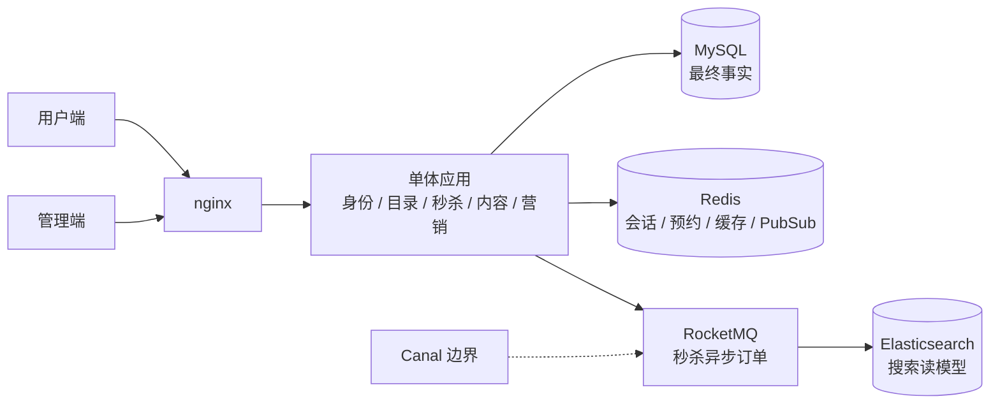
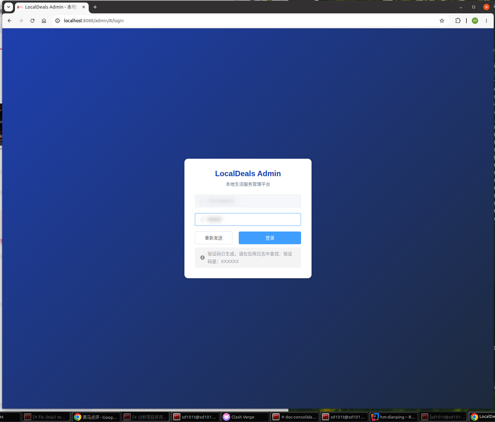
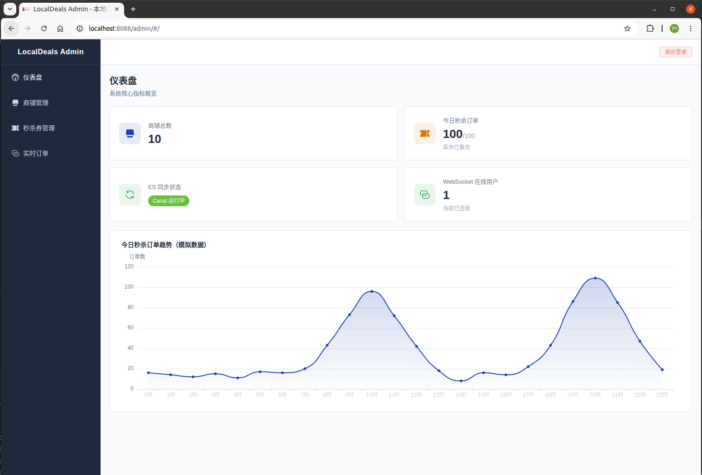
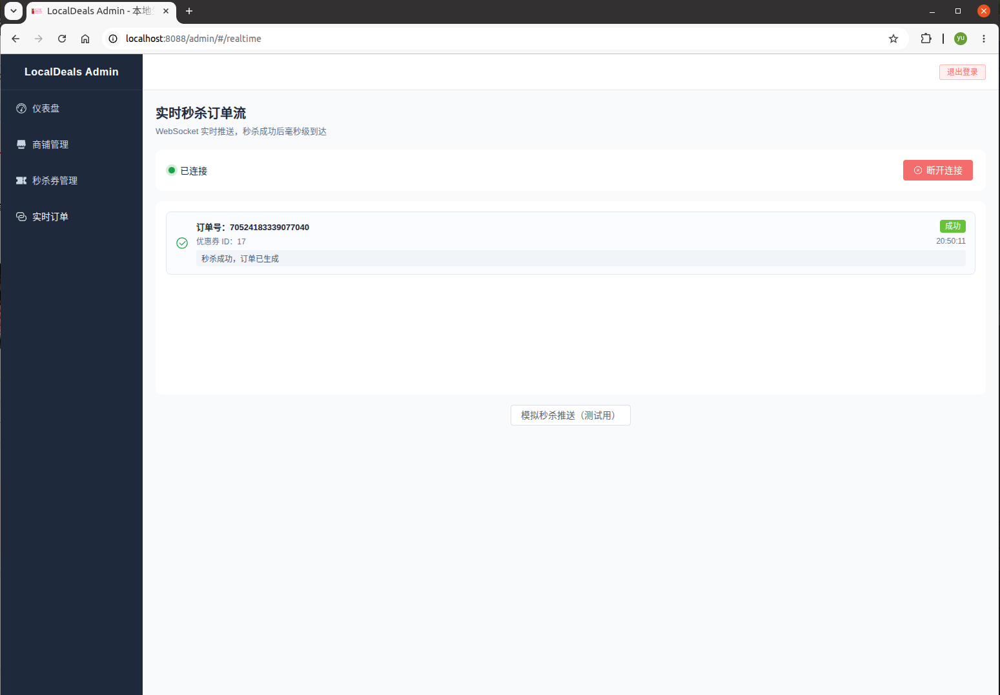
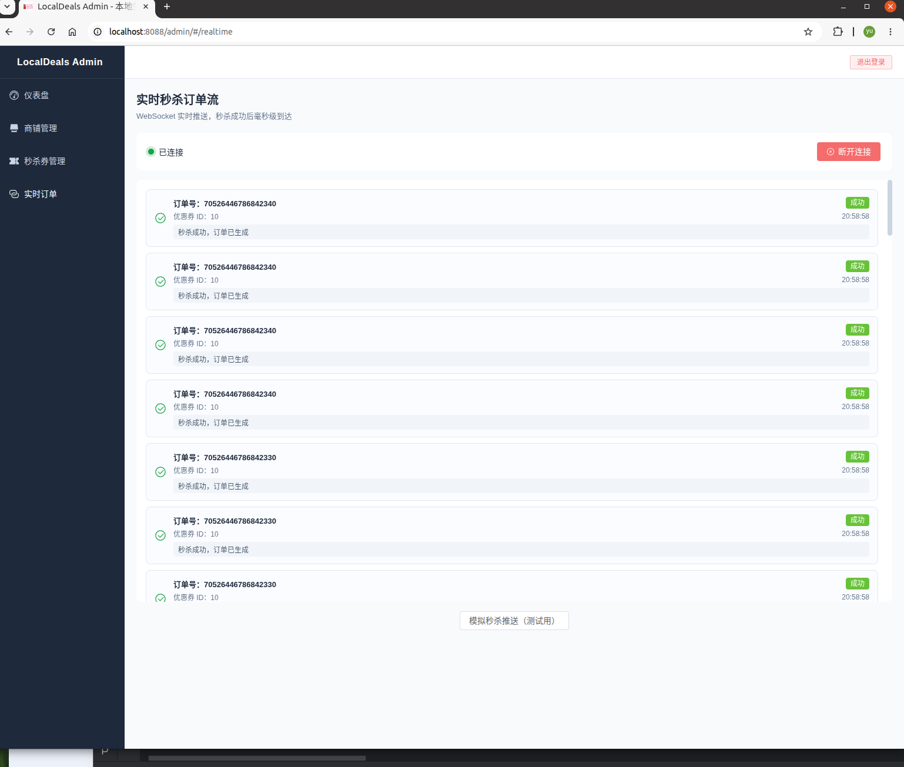

# 优惠券秒杀系统

> 一句话定位：一个以 MySQL 业务事实为核心、用 Redis/RocketMQ/ES/WebSocket 完成可审计本地生活交易与营销闭环的 Java 8 单体服务。

基于黑马点评教程原型改造的本地生活平台。当前正式秒杀链路使用 RocketMQ 事务消息、Redis Lua 精确预约、MySQL 落库与可恢复状态查询；Redis Stream 只保留为历史实验对照，不属于当前正式技术栈。M5/M6 已完成，M7 负责故障证据、演示手册和项目展示收口。

## 系统边界

系统边界图、秒杀状态图、故障矩阵和证据级别统一见 [`docs/m7-evidence-index.md`](docs/m7-evidence-index.md)。核心事实分工是：MySQL 保存长期业务事实；Redis 保存会话、预约和可重建读模型；RocketMQ 负责秒杀异步订单边界；Elasticsearch 是搜索读模型；M6 通知使用 Redis Pub/Sub + WebSocket，不使用 RocketMQ 通知链路。



## 四条主线

- **商户 RBAC 与数据隔离**：独立后台身份、固定角色、merchant scope、范围 SQL 和 WebSocket 会话隔离。
- **秒杀预约、消息、落库和恢复**：资源准入、RocketMQ 事务消息、Lua reservation、`PROCESSING`、重试、补偿、`SUSPENDED`、`QUARANTINE` 和 reconciler。
- **持久点赞 / Outbox / 可重建热榜**：MySQL 关系事实、事务 Outbox、worker 聚合和 generation-fenced Redis top-K。
- **标签、签到、统一发券、批量 Job 和通知 Outbox**：M6A 定向发券、M6B `DAILY_SIGN_IN`/`TASK_REWARD`、M6C MANUAL_TAG 批量 Job、统一 grant ledger、Redis Pub/Sub 通知和持久券包。

## 可量化验证摘要

| 阶段 | 已验证结果 | 证据 |
| --- | --- | --- |
| M5C/M5D | M5D F1–F5 专用 run-id 通过；M5C 过载/门禁结果保留；F4 明确 consumer-level | [`docs/m5d-reliability-results.md`](docs/m5d-reliability-results.md)、[`docs/m5c-resource-traffic-results.md`](docs/m5c-resource-traffic-results.md) |
| M6A/M6B | M6A 统一 grant 与商户隔离；M6B 签到/TASK；V9/V10 fresh/upgrade 结果 | [`docs/m6a-targeted-grant-results.md`](docs/m6a-targeted-grant-results.md)、[`docs/m6b-daily-task-results.md`](docs/m6b-daily-task-results.md) |
| M6C | 100 item：target/granted/idempotent/skipped/failed=`100/100/0/0/0`；6 批；收敛 722ms；Outbox Redis 恢复 25ms；item P99 与入口限流为 `NA` | [`docs/m6c-batch-notification-results.md`](docs/m6c-batch-notification-results.md) |
| M7-RC | 专用 i run：M6C 1000 人 `1000/1000/0/0/0`；RocketMQ S1 三轮全成功；S2 `accepted=100/rejected_stock=900`；不与历史 Stream 计算提升 | [`docs/pre-m8-baseline-results.md`](docs/pre-m8-baseline-results.md)、[`docs/pre-m8-baseline-summary.csv`](docs/pre-m8-baseline-summary.csv) |

数值均是对应专用本地环境的观测或真实数据库行，不是生产 SLA；`NA` 不用 0 冒充测量。

## 历史对照（不作为当前技术栈）

本项目不把秒杀改造包装成未经验证的“吞吐性能大幅提升”。2026-05-20 的历史对比只证明 Stream 可靠性增强没有破坏正常链路，并能闭环异常 pending；当前 RocketMQ 版本则重点解决预约与消息的精确对应、Redis/MySQL 失败补偿、状态可恢复查询和安全边界。两组证据分开记录，避免把旧基准误当成当前架构的性能结论。

| 对比项 | 教程原型 / baseline | 阶段一 `reliable-stream-v1`（历史实验） | 优势结论 |
| --- | --- | --- | --- |
| 正常秒杀压测 | 1000/5000 并发请求下订单正确、pending 清空 | 同样订单正确、pending 清空，`drain_ms` 与 baseline 同量级 | 增加可靠性机制后，正常链路正确性不退化 |
| 异常 Stream 消息 | 缺少 `orderId` 的消息残留 pending，DLQ 为空 | 重试 3 次后写入 `stream.orders.dlq`，pending 清空 | 补齐异常消费闭环，问题可追踪、可恢复 |
| 一人一单兜底 | 主要依赖 Redis Lua 与业务层判断 | 增加 `tb_voucher_order(user_id, voucher_id)` 唯一索引 | DB 层提供最终一致性兜底 |
| 可观测性 | 缺少秒杀链路指标入口 | 暴露请求、消费、重试、死信、pending、DB 幂等等 Prometheus 指标 | 面向排障和运维，而不只是功能演示 |
| 验证方式 | 容易只看 HTTP Error% | JMeter 后自动校验 MySQL、Redis、Stream、DLQ | 结果可复现，可证明业务正确性 |

## 项目亮点

| 教程原型中的边界 | 当前改造 | 证据 |
| --- | --- | --- |
| 搜索只有 MySQL LIKE%，不支持分词和地理位置组合查询 | Elasticsearch 7.17.18 + IK 分词器；`GET /shop/search?keyword=火锅&x=120.15&y=30.33&radius=5000` 单次请求同时做 IK 分词、geo 过滤、相关性排序 | `ShopSearchBeforeIT`（基线）vs `ShopSearchAfterIT`（ES 验证）；`docs/improvement-comparison.md` |
| 秒杀异步消息用 Redis Stream，库存预占与消息投递缺少事务绑定 | RocketMQ 事务消息：半消息 → 本地 Lua 预占 → COMMIT/ROLLBACK；Broker 回查必须同时匹配 `userId → orderId` 精确预约和订单状态所有权，避免仅凭“用户买过”误提交另一条半消息 | `SeckillOrderProducerTest`、`SeckillLuaScriptContractTest`、`SeckillWithRocketMQIT` |
| Redis 预扣成功但 DB 永久失败时直接 ACK，库存和一人一单状态无法恢复 | 消费者写 MySQL 前先用只读 Lua 校验 exact `PROCESSING` 预约；缺失、错属或畸形消息不落库并重试至 DLQ。消费成功后原子标记 `SUCCESS`；DB 库存耗尽或同用户/券冲突时先暂停再精确补偿；主键 orderId 已属其他订单时只暂停并 quarantine，绝不自动释放 | `SeckillOrderStateIT`、`SeckillOrderConsumerTest`、`VoucherOrderReliabilityIT` |
| 预占消息在长期故障/DLQ 后留在 `PROCESSING`，库存和用户购买资格无法自动收敛 | Redis TIME 驱动的 ZSET 持久到期索引 + 与 MQ 消费者共用的用户锁 + MySQL exact 分类；有单修复 `SUCCESS`，无单达到业务截止时间后才可在独立开关下精确补偿，不安全归属进 quarantine | `SeckillOrderReconcilerTest`、`SeckillProcessingIndexBackfillRunnerTest`、`docs/seckill-reconciliation.md` |
| 新活动才写 Redis 元数据，升级后存量活动会被 fail-closed 拒绝 | 启动时从 MySQL 幂等回填存量券；库存只在 key 不存在时初始化，活动字段只补缺失值，不覆盖实时预扣或 `SUSPENDED` | `SeckillVoucherRedisInitializerTest`、`SeckillVoucherRedisInitializerIT` |
| MySQL 和 ES 之间无数据同步机制，双写侵入业务代码 | Canal 伪装 MySQL 从节点监听 binlog → 配置化 RocketMQ topic/group → `EsSyncConsumer` → ES；目标消息解析、转换或写入失败会抛出并进入 retry/DLQ，固定文档 ID 保证重放幂等；DDL/无关表 ACK | `CanalSyncIT` 是直接调用 consumer 的 consumer-level ES 验证，不是 Canal E2E；故障恢复见 `docs/m5d-reliability-results.md` |
| 秒杀结果只依赖单次实时通知，断线或跨实例异常后用户无法确认结果 | WebSocket + Redis pub/sub 作为快速通知，`GET /voucher-order/status/{orderId}` 作为用户隔离的持久兜底；前端超时后有限轮询，64 位订单 ID 全链路按字符串传输 | `WebSocketNotifierTest`、`SeckillWebSocketIT`、`VoucherOrderServiceImplTest` |
| 商铺、优惠券写接口匿名可调用，消费者账号可冒充管理端，管理广播没有商户边界 | 新增独立 `tb_admin_account` + BCrypt 登录、固定角色 RBAC 和以 `tb_shop.merchant_id` 为根的数据范围；旧写映射退役。后台 WebSocket 使用 30 秒一次性 ticket、平台/商户独立频道和发送前权限复核；同一连接的并发发送有界串行化 | `AdminMvcSecurityTest`、`AdminRbacIT`、`AdminCatalogServiceTest`、`WebSocketSessionIsolationTest` |
| 点赞用 Redis ZSET 判状态且每次请求直接更新 `tb_blog.liked`，并发重试会双计、Redis 丢失后无法恢复用户身份 | `tb_blog_like` 作为身份真相，显式 PUT/DELETE 与不可变 outbox 同事务；worker 聚合 delta 并与 processed 标记同事务。旧 Redis 身份需停写导入，持久 cutover marker 未完成时生产写入 fail-closed | `BlogLikeCommandServiceTest`、`BlogLikeReliabilityIT`、`docs/blog-like-hot-rank.md` |
| 热榜每次直接查库且同分分页不稳定，缓存缺失容易把空/坏状态当有效结果 | V7 复合索引 + `liked DESC,id DESC`；Redis top-K 用 generation-fenced 临时榜原子发布，校验 count/capacity/freshness，任何不安全状态整页回退 MySQL | `BlogHotRankServiceTest`、`BlogHotRankRedisIT` |
| 验证码可重复使用、可在有效期内无限猜测 | Redis Lua 原子完成 60 秒发送冷却、一次性消费和每个验证码最多 5 次失败尝试；日志默认不输出验证码 | `UserServiceImplTest`、`UserServiceIT` |
| 上传目录硬编码，删除接口可路径穿越或跨用户删除 | 上传根目录与 5 MB 上限配置化，校验扩展名/MIME/文件头；`tb_upload_file` 记录归属及 TEMP/DELETING/PUBLISHED 状态，只允许上传者删除未发布图片 | `UploadControllerTest`、`UploadFileServiceIT`、Flyway V3/V4 |
| 秒杀链路主要依赖 Redis Lua 和业务层判断，DB 层缺少最终兜底 | 增加 `tb_voucher_order(user_id, voucher_id)` 唯一索引，并在落库时处理 `DuplicateKeyException` | Flyway 迁移：`src/main/resources/db/migration/`；核心实现：`SeckillOrderConsumer#onMessage` |
| Redis Stream 消费失败后主要依赖 pending-list 重试，失败消息缺少明确归宿 | 增加 pending 重试计数、最大重试次数和 dead-letter Stream（第一阶段可靠性增强，已由 RocketMQ 内置 DLQ 取代） | `stream.orders.dlq`、`docs/reliability-results.md` |
| 压测容易只看 HTTP Error%，无法证明业务正确性 | 当前脚本同时校验 MySQL 订单数、重复下单、DB/Redis 库存、精确 reservation 数、全部 `SUCCESS` 终态、活动状态和本券 processing index 归零；Broker 堆积/DLQ 明确交由 RocketMQ 运维面观察 | `scripts/run-seckill-benchmark.sh`、`docs/jmeter-usage.md` |
| 异步下单链路缺少运行时观测入口 | 接入 Micrometer / Prometheus，暴露秒杀请求分流、MQ 消费结果、DB 幂等与库存回滚等指标 | `/actuator/prometheus` |
| 关键依赖故障只能靠日志猜测，Actuator 与业务入口同面暴露 | M5A 建立固定枚举指标目录，补齐点赞/Outbox、热榜、商铺缓存、认证、ES consumer 和秒杀 backlog 观测；management 仅绑定 loopback 独立端口，nginx 明确拒绝 `/api/actuator` | `docs/m5a-metric-catalog.md`、`docs/m5a-observability-results.md` |
| 突发秒杀在 ID/MQ 前无共享准入，缓存/搜索故障可能放大 DB/ES 并返回模糊 HTTP 200 | M5C 在 ID/MQ 前用 Redis TIME Lua 做 activity/user/IP 固定窗；DB_READ/SEARCH 仅两枚 JVM semaphore；follower 750ms 有界等待；统一 429/503/业务码，ES 故障不回退无界 MySQL LIKE | `docs/m5c-resource-traffic-results.md`；M5D 严格 PID/TCP 隔离门禁后补做 Broker F5，20/20 为 503 且业务无增量 |


## 前端

> 前端部分非本项目重点，由 AI 辅助生成，主要作为后端功能的可视化验证入口。

### 用户端（手机 H5）

基于教程原型改进，运行在 `http://localhost:8088/`：

- 修复笔记详情页硬编码"叶小乙"重复评论，改为从 `GET /blog/of/shop` 动态拉取真实评论
- 修复搜索结果页二次搜索无结果（移除关键词搜索时的地理坐标过滤，测试数据集中在杭州，真实坐标会导致 0 结果）
- 修复商户搜索结果图片不显示（ES 文档 `ShopDoc` 无 `images` 字段，改为 ES 返回 ID 后再查 MySQL 获取完整字段）
- nginx 开启 gzip 压缩 + 7 天静态资源缓存（`vue.js` / `element.js` / `element.css` 合计 1.15 MB → gzip 后约 350 KB，消除每次跳页重复下载）

### 管理端（Vue 3 SPA，AI 辅助生成）

新增管理端前端，运行在 `http://localhost:8088/admin/`，基于 Vue 3 + Vite + Element Plus 构建，通过 nginx 反向代理与后端通信：

| 页面 | 功能 |
| --- | --- |
| 登录 | 独立后台用户名 + BCrypt 密码；消费者短信 token 不能进入 `/admin/**` |
| 仪表盘 | 展示当前账号、数据范围、权限数量和范围内商铺概况，不再使用模拟订单数据 |
| 实时订单 | 先申请 30 秒一次性 ticket，再建立 WebSocket；平台与商户频道隔离，支持手动断开重连 |
| 秒杀券管理 | 在当前商户可见商铺内查询和创建秒杀券；商铺 ID 篡改由后端范围 SQL 再次拦截 |
| 商铺管理 | 分页/关键词查询范围内商铺，按权限显示更新入口；历史待分配商铺由平台 API 一次性认领 |

**登录**



**仪表盘**



**实时秒杀订单流**（运行 `scripts/run-seckill-benchmark.sh --threads 100 --loops 1 --stock 100 --user-count 1000` 后）





## 测试策略

### 测试理念

测试按风险分层：纯单元测试验证分支和协议契约；真实 Redis/MySQL 测试验证 Lua 原子状态与数据库事务；真实 RocketMQ 测试验证事务消息和重投递。只在隔离非目标外部副作用时使用 Mock，并明确测试边界，不把 Mock 测试描述成完整端到端证据。

### Bug → 测试 → 修复 对照表

| Bug | 测试 | 关键结论 |
| --- | --- | --- |
| `BlogServiceImpl.queryBlogUser` 在用户被删除时抛 NPE | `BlogServiceIT` · `queryBlogUser_deletedUser_doesNotThrowNPE` | 先写测试复现 NPE，加 null guard 后通过 |
| `CacheClient.queryWithLogicalExpire` 缓存缺失时抛 NPE | `CacheClientIT` · `queryWithLogicalExpire_returnsNull_whenCacheIsEmpty` | 防御性 null 检查，避免 JSON 反序列化崩溃 |
| `CacheClient` 锁 key 硬编码 `LOCK_SHOP_KEY`（通用方法用了专属常量） | `CacheClientIT` · `queryWithLogicalExpire_lockKey_usesKeyPrefix` | 任何非 Shop 实体使用逻辑过期时会争抢同一把锁，修复为 `"lock:" + keyPrefix + id` |
| `UserServiceImpl` 新用户 icon 为 null 时 Hutool `fieldValueEditor` 抛 NPE | `UserServiceIT` · `login_newUserWithNullIcon_doesNotThrowNPE` | `fieldValueEditor` 需要显式判 null |
| `RedisIdWorker.nextId` 高并发下是否产生重复 ID | `RedisIdWorkerIT` · `nextId_30kConcurrentCalls_allUnique` | 300 线程 × 100 次 = 30,000 个 ID 全部唯一 |

### 集成测试覆盖速览

| 测试类 | 层次 | 测试内容 |
| --- | --- | --- |
| `RedisIdWorkerIT` | 工具层 | 高并发下 ID 无重复 |
| `CacheClientIT` | 工具层 | 逻辑过期空缓存处理；锁 key 前缀正确性 |
| `UserServiceIT` | Service 层 | 新用户登录（icon=null）不崩溃，返回 token |
| `BlogServiceIT` | Service 层 | 查询已删除用户的博客不抛 NPE，gracefully 返回空字段 |
| `ShopServiceIT` | Service 层 | 缓存缺失→查 DB→写缓存；不存在商铺写短期空值；后台写入后清理缓存 |
| `ShopSearchBeforeIT` | 搜索基线 | MySQL LIKE% 搜索结果数和耗时（before 对比数据） |
| `ShopSearchAfterIT` | ES 搜索 | IK 分词 + geo-distance 组合查询；结果与 before 对比 |
| `SeckillWithRocketMQIT` | MQ 秒杀 | 500 并发 / 100 库存：恰好 100 个预约经真实 RocketMQ 收敛为 `SUCCESS`；DB 写入在本测试中隔离为 Mock |
| `SeckillOrderStateIT` | Redis 状态机 | 精确预约成功、失败补偿及重复补偿幂等 |
| `SeckillProcessingIndexBackfillRunnerTest` | 升级回填 | lazy SCAN 精确回填；终态/已隔离跳过；canonical owner 不安全时拒绝启动，非规范 raw key 留存并隔离 |
| `SeckillOrderReconcilerTest` | 超时对账 | DB exact 修复、无单延后/补偿、冲突隔离、补偿独立开关与共享锁 |
| `VoucherOrderReliabilityIT` | MySQL 事务 | 库存不足回滚、同订单重放幂等、用户/券冲突与跨 owner 主键碰撞分类 |
| `SeckillVoucherRedisInitializerIT` | 升级兼容 | 存量活动回填且不覆盖实时库存、暂停状态和已有时间 |
| `CanalSyncIT` | Canal 同步 | 直接调用 `EsSyncConsumer.onMessage(json)`；验证 INSERT/UPDATE/DELETE 三种操作同步到 ES |
| `SeckillWebSocketIT` | WebSocket | Awaitility 3s 内断言 mock session.sendMessage() 被调用，消息含 `"success":true` |
| `AdminMvcSecurityTest` | MVC 边界 | 真实 Controller 映射与拦截链：匿名/消费者 token 拒绝、权限不足 403、旧写映射 404/405 |
| `AdminRbacIT` | MySQL + Redis | V5/V6 前向迁移、商户范围 SQL、独立登录、一次性 WS ticket、改密/停用即时撤销会话 |
| `BlogLikeReliabilityIT` | MySQL 事务 | 显式状态并发幂等、关系/outbox 原子回滚、worker 重放与并发只应用一次；仅可在隔离 schema 运行 |
| `BlogHotRankRedisIT` | Redis Lua | generation 原子发布、新博客与旧 builder 竞态、top-K 裁剪及空榜；仅可在隔离 Redis 运行 |

默认安全检查不连接外部依赖；不要直接运行可能连接共享依赖的 `-Dtest="*IT"`：

```bash
mvn -o -DskipTests compile test-compile
mvn -o test
node scripts/check-m5c-frontend.js
node scripts/check-m6a-frontend.js
node scripts/check-m6b-frontend.js
node scripts/check-m6c-frontend.js
node scripts/check-m7-frontend.js
```

外部集成测试必须由对应阶段的专用隔离脚本显式提供 run-id、端口、sentinel 和依赖；M5D/M6C
的既有结果入口见 [`docs/m7-evidence-index.md`](docs/m7-evidence-index.md)。

## 对比验证摘要

2026-05-20 对比验证覆盖 baseline 与 `reliable-stream-v1` 的正常压测和异常消息注入。正常链路用于证明“可靠性增强后不破坏正确性”，故障注入用于证明“原始 pending 残留问题被闭环处理”。

| 验证场景 | baseline 结果 | `reliable-stream-v1` 结果 | 结论 |
| --- | --- | --- | --- |
| 1000 线程 / 1 次循环 | 订单 1000/1000，pending 0，DLQ 0，`drain_ms=73` | 订单 1000/1000，pending 0，DLQ 0，`drain_ms=72` | 正常链路正确性不退化 |
| 5000 线程 / 1 次循环 | 订单 1000/1000，pending 0，DLQ 0，`drain_ms=71` | 订单 1000/1000，pending 0，DLQ 0，`drain_ms=81` | 高并发尖峰下仍保持一致性 |
| 缺少 `orderId` 的异常 Stream 消息 | pending 1，DLQ 0 | pending 0，DLQ 1，`retries=3` | 当前版本具备异常消费闭环 |

完整结果见 [压测结果记录](docs/benchmark-results.md)、[故障注入结果](docs/reliability-results.md) 和 `docs/JmeterTestSummary/`。

## Quick Start

**前置要求**：JDK 8、Maven、MySQL 8、Redis 6+（本地安装或 Docker 均可）

```bash
# 1. 准备环境变量（填写 MySQL / Redis 密码）
cp .env.example .env
# 编辑 .env，填入真实 MySQL / Redis 密码
# 首次创建平台管理员时，临时设置 LOCAL_DEALS_ADMIN_BOOTSTRAP_USERNAME/PASSWORD
# 密码至少 12 个字符且不超过 72 个 UTF-8 字节；验证登录后从运行环境移除 bootstrap 凭据
# 消费者短信登录仍未接入真实短信供应商；验证码日志只允许在隔离的本地环境显式开启
set -a && source .env && set +a
```

后台身份与消费者 `tb_user` 完全隔离。首次启动若没有平台账号且未配置 bootstrap 凭据，后台保持 fail-closed；bootstrap 只负责创建第一个平台账号，不会覆盖已有账号密码。V5 会把存量商铺归入停用的 `LEGACY_UNASSIGNED` 主体，平台管理员需通过 `PUT /admin/shops/{id}/merchant` 将它们一次性认领给启用商户；已归属商铺禁止跨商户换绑。完整模型、权限矩阵与 API 见 [商户后台与 RBAC](docs/admin-rbac.md)。

后台登录按“用户名 + 客户 IP”累计失败，并在查库/BCrypt 前用 Redis Lua 原子占用客户 IP 请求配额。只有直连地址命中 `LOCAL_DEALS_ADMIN_TRUSTED_PROXIES` 时才读取 nginx 的真实 IP 头；仓库自带的 Compose 将 nginx 固定为 `172.30.55.10`，修改子网时必须同步修改信任列表。生产环境必须把该列表收窄为实际代理地址并阻止客户端直连 8083。图片上传记录由 Flyway 创建的 `tb_upload_file` 管理；笔记发布会在同一数据库事务中把图片从 `TEMP` 转为 `PUBLISHED`，已发布图片不能再通过临时删除接口移除。

应用启动时会校验并回填所有存量秒杀券的 Redis 活动元数据。回填不会覆盖已经存在的 Redis 库存或暂停状态；若数据库记录非法、数据库不可读或 Redis 回填失败，应用会拒绝启动，修复依赖或数据后可安全重试。

**启动 MySQL 和 Redis**（二选一）：

当前秒杀 Lua 会同时访问库存、活动、预约和订单状态多个 Key，部署契约是单机 Redis 或 Sentinel（共享同一主节点）；尚未支持 Redis Cluster。若迁移到 Cluster，需要先把同一秒杀活动的相关 Key 统一为相同 hash-tag，并迁移旧数据，不能直接切换。

```bash
# 方式 A：Docker Compose（推荐，开箱即用）
docker compose up -d

# 方式 B：使用已有的本地 MySQL / Redis 服务
# 确保 MySQL 已创建数据库，Redis 已启动，并在 .env 中配置好连接信息
# application.yaml 中的 spring.datasource / spring.redis 会从 .env 读取
```

```bash
# 2. 启动服务（Flyway 自动初始化表结构，无需手动建表）
mvn spring-boot:run
# 服务启动后默认监听 http://localhost:8083

# 3. （可选）运行秒杀压测
# 额外需要：jmeter、mysql client、redis-cli 在 PATH 中
scripts/run-seckill-benchmark.sh \
  --threads 100 \
  --loops 1 \
  --stock 100 \
  --user-count 1000
# MySQL/Redis 连接参数从 .env 中的 LOCAL_DEALS_* 自动读取，无需额外指定容器名
# 压测结束后自动校验 MySQL 订单、Redis 库存/预约/活动状态，并输出 P95/P99

# 外部 RocketMQ/ES/Redis/MySQL IT 不在 Quick Start 中直接运行；必须使用对应阶段的隔离脚本和新 run-id
# 历史 Redis Stream 故障注入结果保留在 docs/reliability-results.md，不作为当前链路验收命令
```

生产和联调环境应在应用启动前通过 Dashboard 或 `mqadmin updateTopic` 预创建
`seckill-order-topic`，不要依赖首个下单请求自动建 Topic。消费者在尚无 offset 时从
Topic 起点消费，避免空 Broker 冷启动期间已经提交的首批事务消息被跳过；已有消费组
offset 不受影响。

### 从旧版秒杀消息契约升级

本阶段把旧版的“库存 + 用户 Set”预占升级为带 `orderId` 的精确 reservation/status。
旧消息无法反推出可信的 orderId，因此**禁止旧版与本版滚动混跑，也禁止让本版消费者
直接接管尚未排空的旧消息**。发布必须执行以下门禁：

1. 在网关或上游关闭 `POST /voucher-order/seckill/**`，确认不再产生新秒杀请求。
2. 保持旧版实例运行，用 Dashboard 或下列命令确认旧消费者组 `diffTotal=0`：

   ```bash
   "$ROCKETMQ_HOME/bin/mqadmin" consumerProgress \
     -n "$ROCKETMQ_NAMESRV_ADDR" \
     -g seckill-consumer-group
   ```

3. 继续保留旧版事务生产者的回查能力，按当前 Broker 的事务检查配置等待并确认没有待决
   half message；这一项必须从 Dashboard/Broker 配置核实，不能只用 consumer lag 代替。
4. 按活动逐一核对旧 Redis `seckill:order:{voucherId}` 人数与 MySQL 已落订单，异常先人工
   对账，不能靠新版 initializer 猜测缺失的 orderId。
5. 停止全部旧实例后再部署本版；启动回填成功后做一笔冒烟下单，必须同时看到精确
   reservation、`SUCCESS` 状态、MySQL 订单和两侧库存一致，才恢复入口流量。

如果业务不允许停写，应先实现并预创建独立的 v2 Topic、消费者组和事务生产者组，让旧
链路完全排空后再下线。当前代码没有提供这条双轨发布能力，因此不能把普通滚动发布当成
安全方案。

### 从旧版管理端升级

旧实例仍包含消费者登录复用、旧写接口或无商户范围的管理 WebSocket，因此 V5/V6 **不支持
新旧实例滚动混跑**。发布前先在网关封禁旧版 `POST/PUT /shop/**`、`POST /voucher/**` 和旧管理
WebSocket，停止全部旧实例并备份数据库，再让单个新实例执行 Flyway V5/V6。随后完成平台账号
bootstrap、创建商户/主账号、认领 `LEGACY_UNASSIGNED` 商铺及跨商户 404 冒烟验证，最后移除
bootstrap 密码并恢复管理入口。无法安排该停机窗口时，应先实现版本化后台入口和双轨隔离；
当前代码不支持用普通滚动发布规避门禁。

### 从旧版点赞与热榜升级

V7/V8 将点赞身份迁移到 MySQL 关系表，并用事务 outbox 异步聚合计数；Redis 只保留可重建
的有界热榜。该阶段同样**禁止新旧节点滚动混跑**：旧节点会继续绕过关系表/outbox 写计数，
旧静态页面也仍发送不可重试的 toggle 请求。

安全默认下 `LOCAL_DEALS_BLOG_LIKE_WRITE_ENABLED=false`、`WORKER_ENABLED=false`。发布时先在
网关停点赞、停止全部旧实例并冻结 `blog:liked:*`，再由不接流量的单实例设置
`LEGACY_BACKFILL_ON_STARTUP=true` 导入身份。导入成功且全库恒等式、pending outbox 均为 0
后才会写入持久 cutover marker；生产环境缺少该 marker 时，即使误开 write/worker 也会启动
失败。随后关闭 backfill，显式开启 write/worker；热榜先开 refresh 并核对 MySQL/Redis top-K，
最后 canary 开 read。浏览器静态缓存也必须清理或版本化，因为旧无参数 URL 会按设计返回 400。

完整 SQL 核对、配置组合、回滚边界与隔离测试要求见
[点赞持久化、Outbox 聚合与热榜发布门禁](docs/blog-like-hot-rank.md)。

## 技术栈

**后端**
- Java 8 / Spring Boot 2.3.12 / MyBatis-Plus
- MySQL 8 / Flyway
- Redis 6 / Redis GEO / Bitmap / Redis pub/sub（Redis Stream 仅为历史实验）
- Redisson（分布式锁）
- Elasticsearch 7.17.18 + IK 分词器（`ik_max_word` 索引 / `ik_smart` 搜索）+ geo_point
- RocketMQ client 5.0.0 / Broker 5.2.0（事务消息、`@RocketMQTransactionListener`）
- Canal Server 1.1.7（binlog 解析，FlatMessage → RocketMQ）
- WebSocket（`TextWebSocketHandler`，Redis pub/sub 多实例路由）
- Actuator / Micrometer / Prometheus
- JMeter（自动化压测与故障注入）

**前端**
- 用户端：Vue 2 CDN + Element UI（H5 多页应用，无构建步骤）
- 管理端：Vue 3 + Vite + Element Plus（SPA，`npm run build` 输出到 `dist/`）
- nginx（反向代理 + 静态资源托管 + gzip 压缩 + 7 天缓存）

## 当前重点

- 登录态：验证码登录后将用户信息写入 Redis Hash，拦截器从 `authorization` 请求头恢复 `UserHolder`。
- 管理边界：独立后台账号、固定角色 RBAC、每请求数据库复核与商户范围 SQL；密码或账号安全状态变化通过 `auth_version` 使旧令牌立即失效。
- 商铺缓存：详情和类型字典使用兼容 key/payload 的 cache-aside；Redis 命令和连接池等待均限制为 500ms，miss、坏值或 Redis 不可用时经单 JVM per-key singleflight 回 MySQL，正值/空值分别使用有界 TTL。进程内布隆过滤器会在多实例新增商铺时产生错误否定，未进入权威查询链。
- 优惠券秒杀：RocketMQ 事务消息把半消息与 Redis Lua 原子预占绑定；Lua 使用 Redis 服务端时间校验活动窗口，并记录精确 reservation 与 `PROCESSING` 状态。
- 已覆盖的一致性路径：Flyway 唯一索引作为一人一单最终兜底；落库后标记 `SUCCESS`，永久业务失败时暂停活动并幂等补偿为 `FAILED`，临时故障交给 RocketMQ 重试。
- 结果恢复：WebSocket 用于快速通知，用户隔离的状态接口用于断线兜底；订单 ID 以字符串传输，避免 JavaScript 超过安全整数后精度丢失。
- 可观测性：M5A 指标目录、M5B 有界缓存、M5C 资源门禁和 M5D 故障恢复均已完成；M5D 新增低基数秒杀 DB persist Timer，并在 run-id 专用栈验证 Redis/MySQL/consumer pause/ES/Broker 故障。management 仍独立绑定 loopback，结果见 `docs/m5d-reliability-results.md`。
- 营销闭环：M6A 支持商户标签活动、USER_CLAIM/ADMIN_GRANT 和统一 ONCE ledger；M6B 支持服务端日期的 `DAILY_SIGN_IN`/`TASK_REWARD`；M6C 支持 MANUAL_TAG + ADMIN/BOTH 的可审计批量 Job、快照、pause/resume/retry-failures、失败明细、统一 grant 和事务通知 Outbox。
- 通知边界：M6C 使用 Redis Pub/Sub + 用户 WebSocket 频道 `VOUCHER_GRANTED`，以 `/voucher-grants/mine` 为离线最终事实；Outbox `PUBLISHED` 只表示 Redis 接受发布，不表示用户在线或已读。
- 附近商铺：使用 Redis GEO 按距离检索商铺，并将距离写回响应对象。

### 管理端本阶段边界

当前管理端采用固定的 `PLATFORM_ADMIN`、`MERCHANT_OWNER`、`MERCHANT_STAFF` 三角色；尚未实现自定义角色编辑、按单店授权、主/子供应商层级和历史订单查询 API。`order:read` 已预留为稳定权限码，管理端 SPA 目前只提供目录维护与实时订单页面；商户、员工账号的管理能力已由 API 提供，但还没有对应的可视化页面。

### 超龄 PROCESSING 恢复

当前版本已为未决 `PROCESSING` 建立无 TTL 的 status 证据和 Redis ZSET 到期索引。定时 reconciler 与 MQ 消费者共用 `lock:order:{userId}`，锁内以 writer MySQL 对 exact 三元组分类：DB 已有完全匹配订单时修复 `SUCCESS`；DB 明确无单且达到业务 `final-timeout` 时，只有独立的 compensation 开关已审批才 exact compensate。迟到 MQ 在 `FAILED` 门禁下 ACK 且不落库。DB 异常、orderId 错属和不可证明状态一律 fail-closed。

为防止升级时把旧 status TTL 和缺失索引带入新 worker，reconciler、对账器超时自动补偿和一次性 backfill 是三个默认关闭的独立开关。发布必须执行“停写 → 停旧实例 → 单实例 lazy SCAN/exact Lua 回填 → 观察 quarantine → 先开无补偿对账 → 再审批补偿”门禁，禁止新旧消息契约滚动混跑。无补偿阶段仍会修复 DB exact 订单、暂停冲突活动和隔离不安全状态，并非只读扫描；该开关不关闭 MQ consumer 对已确认永久失败的即时精确补偿。详见 [秒杀 PROCESSING 自动对账与升级门禁](docs/seckill-reconciliation.md)。

## 文档

- [商户后台、RBAC 与发布门禁](docs/admin-rbac.md)
- [秒杀 PROCESSING 自动对账与升级门禁](docs/seckill-reconciliation.md)
- [点赞持久化、Outbox 聚合与热榜发布门禁](docs/blog-like-hot-rank.md)
- [M5A 指标目录](docs/m5a-metric-catalog.md)
- [M5A 基线与故障行为结果](docs/m5a-observability-results.md)
- [M5B 有界缓存实施计划](docs/m5b-bounded-cache-plan.md)
- [M5B 有界缓存实施与验证结果](docs/m5b-bounded-cache-results.md)
- [改进前后对比](docs/improvement-comparison.md)
- [本地环境与常见问题](docs/environment-setup.md)
- [JMeter 使用说明](docs/jmeter-usage.md)
- [秒杀对比验证手册](docs/seckill-comparison-test-runbook.md)
- [压测结果记录](docs/benchmark-results.md)
- [故障注入结果](docs/reliability-results.md)
- [M7 故障证据索引](docs/m7-evidence-index.md)
- [M7 故障矩阵](docs/m7-failure-matrix.csv)
- [M7 15 分钟演示手册](docs/m7-demo-runbook.md)
- [M7 最终结果与限制](docs/m7-results.md)
- [M7-RC 基线计划](docs/pre-m8-baseline-plan.md)
- [M7-RC 基线结果与简历证据](docs/pre-m8-baseline-results.md)
- [M7-RC 机器可读汇总](docs/pre-m8-baseline-summary.csv)

## 外部压测与集成验证

M7-RC 已完成；M8/Java 17/Spring Boot 3 尚未开始。压测和外部 IT 不属于默认 Quick Start。它们必须使用阶段专用隔离脚本、显式 run-id、专用依赖
和对应清理方式；不要把 `-Dtest="*IT"` 指向共享 MySQL/Redis/RocketMQ/ES。秒杀压测参数、业务
不变量和历史对照见 [JMeter 使用说明](docs/jmeter-usage.md) 与 [M7 演示手册](docs/m7-demo-runbook.md)。
