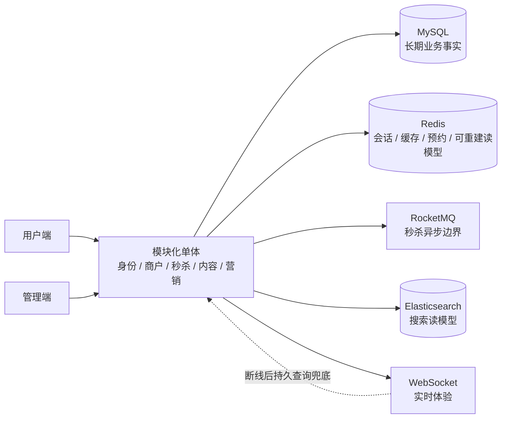

# HM Dianping 本地生活平台

> Java 8 模块化单体：围绕本地生活交易、内容与营销场景，建立可审计的一致性和故障恢复边界。

本项目基于黑马点评教程原型持续改造。它保留商铺、优惠券、秒杀、笔记等核心业务，
重点补齐商户后台、权限与数据隔离、异步交易一致性、持久化点赞与热榜、营销发券和
可观测性。

架构选择以业务事实和恢复能力为中心，而不是以中间件数量为目标。当前 modernization
mainline 与 M7-RC 已完成；项目仍运行在 Java 8 / Spring Boot 2.3.12，M8、Java 17 和
Spring Boot 3 升级尚未开始。

## 系统边界



- MySQL 保存订单、授权、点赞、发券等长期业务事实。
- Redis 承担会话、缓存、秒杀预约和可重建读模型；它不是最终业务账本。
- RocketMQ 是秒杀请求与订单落库之间的异步边界。
- Elasticsearch 是由业务事实派生的搜索读模型。
- WebSocket 提供实时体验，断线或离线时由持久查询接口兜底。

## 核心改造

| 方向 | 当前实现 |
| --- | --- |
| 商户后台与隔离 | 独立后台身份、固定角色 RBAC、merchant scope、范围 SQL 与 WebSocket 会话隔离 |
| 秒杀一致性 | Redis Lua 精确预约 + RocketMQ 事务消息 + MySQL 唯一约束与幂等落库 |
| 恢复与对账 | `PROCESSING` 状态、精确补偿、超龄对账、`SUSPENDED` 与 `QUARANTINE` |
| 点赞与热榜 | MySQL 点赞事实 + Transactional Outbox + generation-fenced 可重建 Redis 热榜 |
| 营销闭环 | 标签、签到、统一 Grant、有限批量 Job 与通知 Outbox |
| 运行保障 | 入口限流、有界缓存降级、Prometheus 指标与专用环境故障演练 |

详细设计、执行证据和历史实验由 [文档索引](docs/README.md) 统一组织。

## 可量化数据

| 验证项 | 正式结果 |
| --- | --- |
| Java 8 默认安全测试 | 321/321 PASS，0 failure/error/skip |
| RocketMQ S1 正确性 | 三轮均 1000/1000 成功 |
| RocketMQ S1 P99 | 64 / 45 / 61 ms |
| RocketMQ S1 中位吞吐 | 208.855 req/s |
| RocketMQ S1 一致性 | 零重复、零超卖、最终 MQ main/retry/DLQ lag = 0/0/0 |
| RocketMQ S2 库存竞争 | accepted/rejected_stock = 100/900 |
| M6C 批量发券 | 1000/1000 发券；idempotent/skipped/failed = 0/0/0；重复 Grant = 0 |
| M5D 故障矩阵 | F1–F5 均保留专用故障证据；F4 明确为 consumer-level |

数据来自专用单机环境，只用于当前实现的正确性、恢复性和本机观测，不是生产 SLA。
S1 的 `1000 threads` 是 JMeter 配置，不表示 1000 个请求严格同时到达；历史 Redis Stream
实验与当前 RocketMQ 链路不可直接计算性能提升百分比。

正式数据、运行边界和失败轮次见
[Pre-M8 最终结果](docs/evidence/pre-m8/pre-m8-baseline-results.md) 与
[M7 结果](docs/evidence/m7/m7-results.md)。

## 技术栈

版本按当前 `pom.xml`、`docker-compose.yml`、`docker-compose.pre-m8.yml` 和
`frontend/admin/package.json` 核对：

- 后端：Java 8、Spring Boot 2.3.12.RELEASE、MyBatis-Plus 3.4.3、Flyway 6.4.4。
- 数据：MySQL 8.0、Redis 6.2、Spring Data Elasticsearch 4.0.9 / Elasticsearch Java client 7.6.2。
- 搜索运行环境：仓库镜像基于 Elasticsearch 7.17.18，并安装 IK 分词器。
- 消息：RocketMQ Spring Boot Starter 2.2.3，传递依赖的 RocketMQ client 5.0.0。
- 测试 Broker：Pre-M8 正式证据使用 `apache/rocketmq:4.9.4`；Broker 版本不等同于客户端版本。
- 实时与观测：Spring WebSocket、Actuator、Micrometer、Prometheus。
- 前端：用户端 Vue 2 + Element UI；管理端 Vue 3.4、Vue Router 4.3、Element Plus 2.7、Vite 5.2；nginx 1.22。

Redis Stream 仅存在于历史归档，不属于当前正式秒杀链路。

## Quick Start

### 环境要求

- JDK 8 与 Maven 3.x。
- Docker Engine 与 Docker Compose v2，用于启动 MySQL 8、Redis 6.2、Elasticsearch 7.17.18 和 nginx。
- 可访问的 RocketMQ NameServer/Broker；仓库默认连接 `localhost:9876`，主 Compose 不负责启动 Broker。
- Node.js 与 npm 仅在需要重新构建管理端时使用。

更完整的版本检查、IDE 设置和常见问题见
[环境搭建](docs/guides/environment-setup.md)。

### 准备环境变量

```bash
cp .env.example .env
# 将 change-me 替换为仅用于本地环境的密码；不要提交 .env
set -a
source .env
set +a
```

首次创建平台管理员时，临时填写 `LOCAL_DEALS_ADMIN_BOOTSTRAP_USERNAME` 和
`LOCAL_DEALS_ADMIN_BOOTSTRAP_PASSWORD`。登录验证后从运行环境移除这两个值；仓库不存在
默认管理员密码。

### 启动 Docker 依赖

```bash
docker compose up -d mysql redis elasticsearch
```

RocketMQ topic 应在联调前通过管理面预创建，不要依赖首个请求自动建 Topic。
完整依赖准备和安全配置见环境搭建指南。

### 启动后端

```bash
mvn spring-boot:run
```

后端默认地址为 `http://localhost:8083`，management 端口默认仅绑定
`127.0.0.1:18084`。Flyway 会在启动时校验并迁移数据库。

启动后可做最小只读检查：

```bash
docker compose ps
curl -fsS http://127.0.0.1:18084/actuator/health
curl -fsS http://localhost:8083/shop-type/list
```

health 端点不展示内部详情；业务接口和 management 端口应保持不同的网络暴露边界。

### 访问用户端和管理端

管理端首次使用前需要构建静态资源：

```bash
npm --prefix frontend/admin ci
npm --prefix frontend/admin run build
docker compose up -d nginx
```

- 用户端：`http://localhost:8088/`
- 管理端：`http://localhost:8088/admin/`
- 后端接口：`http://localhost:8083/`

### 最小安全测试

以下命令不使用 `*IT` 通配符，也不会主动启动外部故障矩阵：

```bash
mvn -o test
```

外部集成测试、Flyway 升级样本、故障演练和压测必须使用对应阶段的隔离脚本、专用
run-id 与显式端口；入口见详细文档，不在 Quick Start 中展开。

## 文档入口

- [详细文档索引](docs/README.md)
- [环境搭建](docs/guides/environment-setup.md)
- [系统设计与证据边界](docs/evidence/m7/m7-evidence-index.md)
- [项目演示手册](docs/guides/project-demo.md)
- [Pre-M8 最终结果](docs/evidence/pre-m8/pre-m8-baseline-results.md)
- [Modernization 路线](docs/modernization-roadmap.md)

## 已知边界

- 当前没有 Redis Sentinel/Cluster 高可用部署。
- Redis 全量数据丢失后的 RPO 尚未验证。
- 完整 Canal Server → RocketMQ → Elasticsearch E2E 尚未验证；现有同步证据保持
  consumer-level 边界。
- WebSocket 不保证离线必达，最终结果依赖持久查询接口。
- 当前没有核销、支付和退款能力。
- Java 17 / Spring Boot 3 升级尚未开始。
