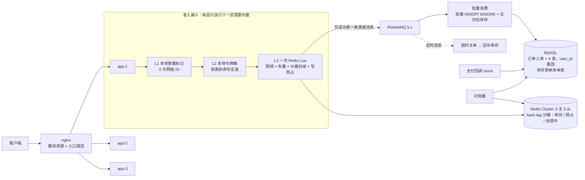
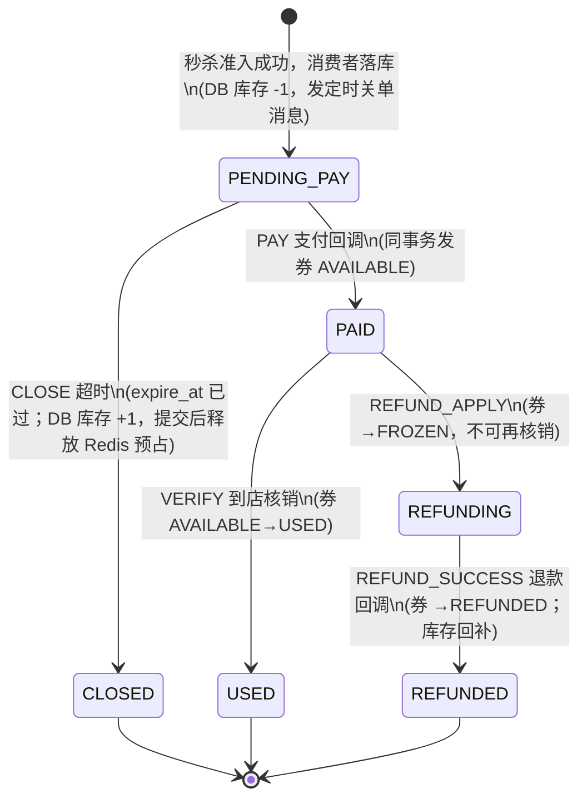

# local-deals-service

**本地生活商户券营销与交易平台——面向万级并发的秒杀、订单闭环与故障恢复。**

一条业务闭环：商户建活动 → 用户抢 / 领 / 买 → 券进资产 → 到店核销 → 退款或过期。

## 架构


```mermaid
flowchart LR
    C[客户端] --> N[nginx\n静态资源 + 入口限流]
    N --> A1[app-1] & A2[app-2] & A3[app-3]
    subgraph funnel[准入漏斗：每层只放行下一层需要的量]
      A1 --> L1[L1 本地售罄标记\n0 次网络 IO]
      L1 --> L2[L2 本地令牌桶\n按剩余库存定速]
      L2 --> L3[L3 一次 Redis Lua\n限频 + 判重 + 分桶扣减 + 写预占]
    end
    L3 -->|仅成功者一条普通消息| MQ[RocketMQ 5.x]
    MQ --> B[批量消费\n批量 INSERT IGNORE + 合并扣库存]
    B --> DB[(MySQL\n订单 2 库 × 4 表，user_id 基因\n库存表单库单表)]
    MQ -. 定时消息 .-> CLOSE[超时关单 → 回补库存]
    PAY[支付回调 mock] --> DB
    REC[对账器] --> DB & R
    L3 --> R[(Redis Cluster 3 主 3 从\nhash tag 分桶：库存 / 预占 / 处理中)]
```

一句话：**让 99% 注定失败的请求在最便宜的层死掉，让 1% 成功的请求以批量方式落库；
Redis 只做可丢的准入层，MySQL 的条件更新是最后防线。**

## 实测数字

单机 16C/30G，k6 开环（`constant-arrival-rate`）。口径、完整数据与不能说的话见
[压测报告](docs/benchmark-report.md)。

| 项 | 改造前 | 现在 | 出处 |
| --- | ---: | ---: | --- |
| 准入拐点（p99 < 100 ms 且丢弃 < 1%） | 5k req/s | **20k req/s**（p99 83 ms） | M3 |
| 10k 档应用 CPU | 3.04 核 | **0.60 核** | M3 |
| 事务半消息数 | = 请求数 | **0** | M3 |
| 订单落库（单实例中位） | 156.3 单/s | **2088.9 单/s** | M4 → M6 |
| 订单落库（3 实例中位） | — | **3026 单/s** | M8 |
| 10 万人抢 1000 件、3 实例 | — | **三方对账闭合**：成功单 1000 = 库存，零超卖零重复零残留 | M8 |

故障演练：

- 应用 `kill -9`：收敛时间 102.8 s → **44.7 s**，重投的订单全部落库，无残留 `PROCESSING`。
- Redis 主节点宕机 ×2：**丢失预占 0、超卖 0**，代价是约 1.26 万个 503。
- 复制空窗后杀主，两晚四轮：Redis 最多多放 **10.3%** 的人，**MySQL 每轮恰好建 30000 单、超卖恒为 0**。

## 订单与券的生命周期


```mermaid
stateDiagram-v2
    [*] --> PENDING_PAY: 秒杀准入成功，消费者落库\n(DB 库存 -1，发定时关单消息)
    PENDING_PAY --> PAID: PAY 支付回调\n(同事务发券 AVAILABLE)
    PENDING_PAY --> CLOSED: CLOSE 超时\n(expire_at 已过；DB 库存 +1，提交后释放 Redis 预占)
    PAID --> USED: VERIFY 到店核销\n(券 AVAILABLE→USED)
    PAID --> REFUNDING: REFUND_APPLY\n(券 →FROZEN，不可再核销)
    REFUNDING --> REFUNDED: REFUND_SUCCESS 退款回调\n(券 →REFUNDED；库存回补)
    CLOSED --> [*]
    USED --> [*]
    REFUNDED --> [*]
```

- 每条边是一次 `UPDATE ... WHERE order_no=? AND status=<源状态>`，影响 0 行即为并发中的失败方；
  除此之外没有任何代码写订单状态。
- 支付回调与超时关单同时到达：只有一方的 CAS 成功。关单赢时，迟到的支付自动退款。
- `CLOSED` / `REFUNDED` 的订单不再占用限购唯一键（生成列为 NULL），用户可以再买一次。
- 领取、后台发放、签到奖励、批量发放与购买，最后都落成同一种券资产；核销、过期、退款只操作它。

## 模块

| 模块 | 职责 |
| --- | --- |
| `trade` | 秒杀准入与批量落库、订单状态机、支付与退款、分片路由、券资产与核销 |
| `marketing` | 活动与标签、定向发放与额度、批量发放 Job、签到奖励、通知 Outbox |
| `merchant` | 商户与店铺、后台身份与 RBAC、merchant scope 数据隔离、操作审计、ES 店铺搜索 |
| `content` | 笔记与点赞（Transactional Outbox）、可重建的 Redis 热榜、图片上传 |
| `platform` | 消费者登录与会话、拦截器、WebSocket 扇出、MQ 基础设施、traceId 与指标 |

## 技术栈

- Java 21、Spring Boot 3.5.16、MyBatis-Plus 3.5.17、Flyway 11.7、ShardingSphere、Redisson 3.52。
- MySQL 8.0、Redis 6.2（3 主 3 从 Cluster）、RocketMQ 5.3.2、Elasticsearch 8.18.8（IK 8.18.8）。
- Actuator / Micrometer / Prometheus；k6 与 async-profiler 用于压测与定位。
- 前端：用户端 Vue 2 + Element UI，管理端 Vue 3.4 + Element Plus 2.7 + Vite 5.2，nginx 1.22。

## Quick Start

```bash
cp .env.example .env && set -a && source .env && set +a
docker compose up -d mysql redis namesrv broker elasticsearch
mvn spring-boot:run          # 业务 8083，management 127.0.0.1:18084
```

用户端 `http://localhost:8088/`，管理端 `http://localhost:8088/admin/`（需先构建静态资源）。
从零走通一次秒杀 → 支付 → 核销的 curl 序列、隔离栈、压测与故障演练、按 traceId 排障，
全在 [运行手册](docs/runbook.md)。

单元与切片测试 `mvn -o test`；集成测试 `scripts/stack.sh up && scripts/stack.sh it '*IT'`。

## 已知边界

- **单机测得的是这台机器上的拐点和扩展趋势，不是生产容量。**「万级」的论证方式是：
  单实例实测值 × 已验证的水平扩展性 + 各层无共享瓶颈的设计说明。
- **准入侧的扩展曲线测不出来，原因不在系统**：1/2/3 实例都是约 25.5k req/s，因为 k6 先吃满了
  自己的核。任何「水平扩展提升了准入吞吐」的说法都不能从这份数据得出。
- **写路径的水平扩展上限是秒杀库存表的那一行**：加实例只加 CPU 不加吞吐（提交次数/s 恒在
  70–115，与实例数无关）。已测实、尚未修。
- 商户后台按商户分页查订单是跨 8 张分片表的广播归并：结果正确，不随分片数扩展；
  独立的订单读模型（Canal → MQ → ES）没有做。
- 一个消费批次可能横跨两个订单库，用的是 LOCAL 事务不是 XA：进程崩在两次提交之间会**少卖**
  （不会超卖），这个窗口尚未用故障注入验证过。
- 支付是 mock 渠道；不涉及真实资金、对账文件、风控。
- **没做**：多机房、RocketMQ 多副本切换、MySQL 主从切换、多级缓存、日终对账。
- traceId：HTTP 全量覆盖；MQ → DB 只接了秒杀链与关单链。
- WebSocket 不保证离线必达，最终结果依赖持久查询接口。

## 文档

- [文档索引](docs/README.md)
- [压测报告](docs/benchmark-report.md)：方法、逐里程碑演进、哪些话不能说
- [ADR](docs/adr/)：每个里程碑一页的背景 / 备选 / 决策 / 代价
- [运行手册](docs/runbook.md)
- [V2 重构计划与进度](docs/plan/v2-high-concurrency-plan.md)

---

业务原型源自黑马点评教程。
