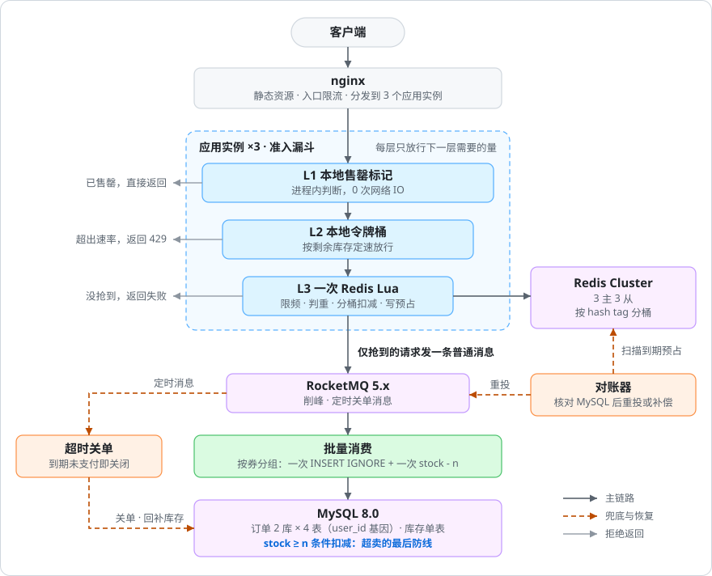
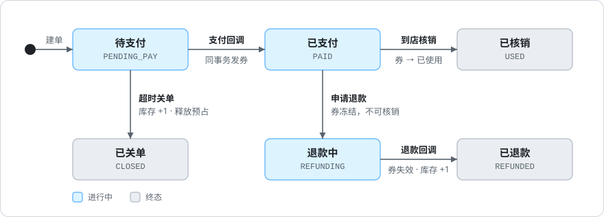

<div align="center">

# local-deals-service

**本地生活商户券营销与交易平台**

面向万级并发的秒杀、订单闭环与故障恢复


[](https://github.com/qiyu-lu/local-deals-service/actions/workflows/ci.yml)

</div>

商户建活动 → 用户抢、领或买 → 券进入资产 → 到店核销 → 退款或过期。项目围绕这条交易闭环，重点解决秒杀高并发下的请求准入、异步建单与故障恢复。

## 核心设计

> 让 99% 注定失败的请求在最便宜的一层结束，让 1% 抢到的请求批量落库；Redis 只做可丢的准入层，MySQL 的条件扣减是防止超卖的最后防线。



- **三层准入漏斗**：本地售罄标记（不走网络）→ 本地令牌桶 → 一次 Redis Lua 完成限频、判重、分桶扣减和写预占。只有抢到的请求才发一条普通消息；改造前，每个请求都要先发一条事务半消息。
- **异步批量落库**：消费者按券分组，一批订单只做一次 `INSERT IGNORE` 和一次 `stock - n` 条件扣减；消息重投与进程崩溃靠唯一键幂等和对账器收敛。
- **Redis Cluster 分桶**：库存按 hash tag 拆桶，同一用户固定落在一个桶里，一次 Lua 用到的 key 都在同一个 slot。
- **订单分库分表**：按 `user_id` 基因分 2 库 × 4 表，按用户或按订单号查询都只命中一个分片。

## 实测数据

> [!NOTE]
> 单机 16C/30G，k6 开环压测（`constant-arrival-rate`）。数字反映这台机器上的拐点与趋势，不代表生产容量；口径与完整数据见[压测报告](docs/benchmark-report.md)。

| 指标 | 改造前 | 改造后 |
| --- | ---: | ---: |
| 准入拐点（p99 < 100 ms 且丢弃 < 1%） | 5k req/s | **20k req/s** |
| 10k req/s 时的应用 CPU | 3.04 核 | **0.60 核** |
| 订单落库速率（单实例中位数） | 156.3 单/s | **2088.9 单/s** |
| 10 万人抢 1000 件（3 实例） | — | **成功 1000 单，零超卖、零重复** |

**故障演练**

- **应用 `kill -9`**：收敛时间从 102.8 s 降到 44.7 s，重投的订单全部落库，没有残留的处理中状态。
- **Redis 主节点宕机**：丢失预占 0、超卖 0，代价是故障转移期间约 1.26 万个请求返回 503。
- **复制空窗后再杀主节点**（4 轮）：Redis 最多多放进 10.3% 的人，MySQL 每轮仍恰好建满 30000 单，超卖为 0。

## 订单生命周期



- 每次状态变化都是一条 `UPDATE … WHERE order_no = ? AND status = <源状态>`，影响 0 行就是并发中的失败方，没有别的代码写订单状态。
- 支付回调与超时关单同时到达时只有一方成功；关单赢了，迟到的支付会自动退款。
- 已关单、已退款的订单不再占用限购唯一键（生成列为 `NULL`），用户可以再买一次。
- 购买、领取、后台发放、签到奖励和批量发放最终都落成同一种券资产，核销、过期、退款只操作它。

## 模块

模块化单体，按业务域分包：

| 模块 | 职责 |
| --- | --- |
| `trade` | 秒杀准入与批量落库、订单状态机、支付与退款、分片路由、券资产与核销 |
| `marketing` | 活动与标签、定向发放与额度、批量发放任务、签到奖励、通知 Outbox |
| `merchant` | 商户与店铺、后台 RBAC 与商户数据隔离、操作审计、Elasticsearch 店铺搜索 |
| `content` | 笔记与点赞（Transactional Outbox）、可重建的 Redis 热榜、图片上传 |
| `platform` | 登录与会话、拦截器、WebSocket 推送、MQ 基础设施、traceId 与指标 |

## 技术栈

| 类别 | 选型 |
| --- | --- |
| 后端 | Java 21、Spring Boot 3.5、MyBatis-Plus 3.5、ShardingSphere-JDBC 5.5、Redisson 3.52、Flyway 11 |
| 中间件 | MySQL 8.0、Redis 6.2 Cluster（3 主 3 从）、RocketMQ 5.3、Elasticsearch 8.18（IK 分词） |
| 观测与压测 | Spring Boot Actuator、Micrometer、Prometheus、k6、async-profiler |
| 前端 | 用户端 Vue 2 + Element UI，管理端 Vue 3 + Element Plus + Vite，nginx 托管 |

## 快速开始

```bash
cp .env.example .env && set -a && source .env && set +a
docker compose up -d mysql redis namesrv broker elasticsearch
mvn spring-boot:run   # 业务端口 8083，管理端口 127.0.0.1:18084
```

用户端 `http://localhost:8088/`，管理端 `http://localhost:8088/admin/`（需先构建前端静态资源）。完整的秒杀 → 支付 → 核销演示、隔离环境、压测与故障演练见[运行手册](docs/runbook.md)。

测试：`mvn test` 跑单元与切片测试；`scripts/stack.sh up && scripts/stack.sh it '*IT'` 跑集成测试。

## 已知边界

- **压测是单机的**：准入侧 1、2、3 个实例都在约 25.5k req/s 封顶，原因是压测客户端 k6 先跑满了 CPU，所以准入侧的水平扩展没有测出来。
- **写路径的上限是库存表那一行**：多加实例只增加 CPU，不增加落库吞吐；已测实，尚未优化。
- **跨库批次用本地事务**：一个消费批次可能横跨两个订单库，进程崩在两次提交之间会少卖（不会超卖），这个窗口还没做故障注入。
- **商户后台按商户查订单**是跨 8 张表的广播归并：结果正确，但不随分片数扩展。
- **没做**：真实支付渠道（目前是 mock）、多机房、RocketMQ 与 MySQL 的主从切换、多级缓存。

---

<sub>业务原型源自黑马点评教程。</sub>
