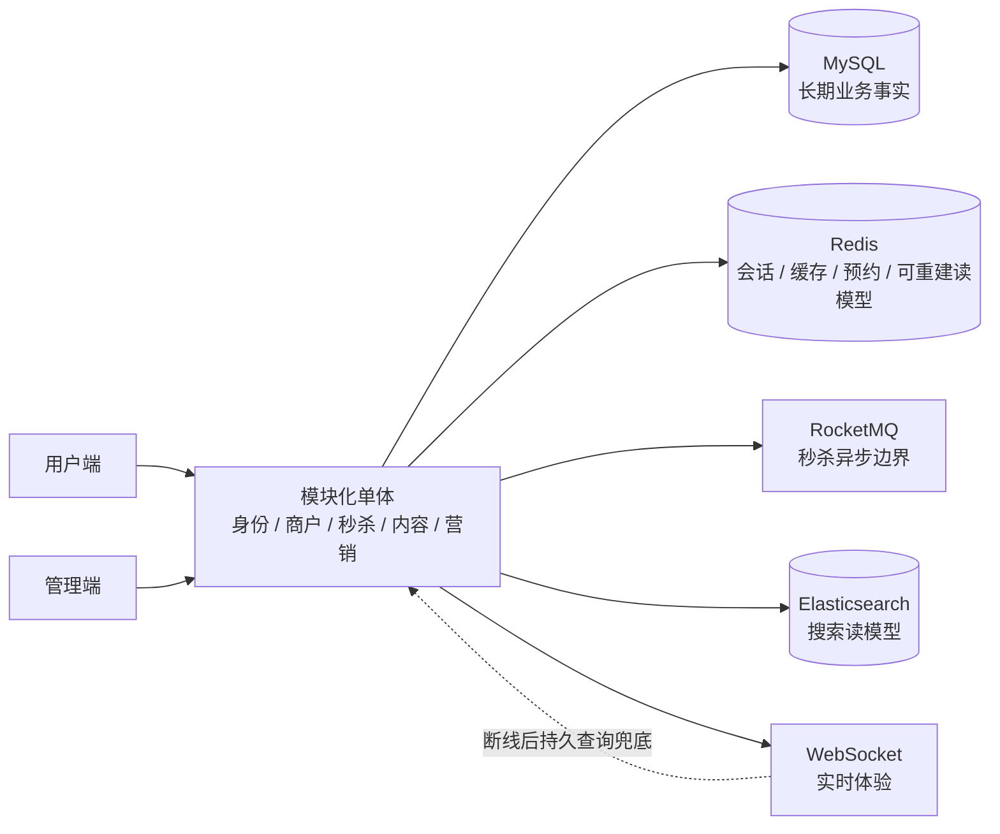
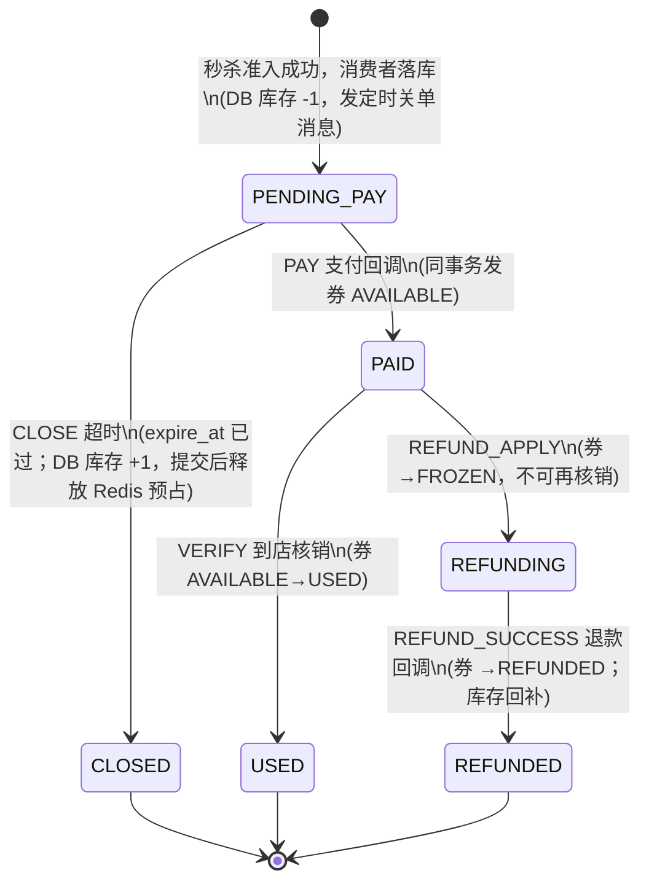

# HM Dianping 本地生活平台

> Java 21 模块化单体：围绕本地生活交易、内容与营销场景，建立可审计的一致性和故障恢复边界。

本项目基于黑马点评教程原型持续改造。它保留商铺、优惠券、秒杀、笔记等核心业务，
重点补齐商户后台、权限与数据隔离、异步交易一致性、持久化点赞与热榜、营销发券和
可观测性。

架构选择以业务事实和恢复能力为中心，而不是以中间件数量为目标。V2 按
[重构计划](docs/plan/v2-high-concurrency-plan.md) 逐里程碑推进；M1 起运行在 Java 21 /
Spring Boot 3.5（[ADR 0002](docs/adr/0002-m1-java21-boot3.md)）；M2 补上订单闭环：支付、超时关单、
退款、券资产与核销（[ADR 0003](docs/adr/0003-m2-order-lifecycle.md)）。

## 系统边界


```mermaid
flowchart LR
    U[用户端] --> APP[模块化单体\n身份 / 商户 / 秒杀 / 内容 / 营销]
    A[管理端] --> APP
    APP --> DB[(MySQL\n长期业务事实)]
    APP --> R[(Redis\n会话 / 缓存 / 预约 / 可重建读模型)]
    APP --> MQ[RocketMQ\n秒杀异步边界]
    APP --> ES[(Elasticsearch\n搜索读模型)]
    APP --> WS[WebSocket\n实时体验]
    WS -. 断线后持久查询兜底 .-> APP
```

- MySQL 保存订单、授权、点赞、发券等长期业务事实。
- Redis 承担会话、缓存、秒杀预约和可重建读模型；它不是最终业务账本。
- RocketMQ 是秒杀请求与订单落库之间的异步边界。
- Elasticsearch 是由业务事实派生的搜索读模型。
- WebSocket 提供实时体验，断线或离线时由持久查询接口兜底。

## 订单与券的生命周期


```mermaid
stateDiagram-v2
    [*] --> PENDING_PAY: 秒杀准入成功，消费者落库\n(DB 库存 -1，发定时关单消息)
    PENDING_PAY --> PAID: PAY 支付回调\n(同事务发券 AVAILABLE)
    PENDING_PAY --> CLOSED: CLOSE 超时\n(expire_at 已过；DB 库存 +1，提交后释放 Redis 预占)
    PAID --> USED: VERIFY 到店核销\n(券 AVAILABLE→USED)
    PAID --> REFUNDING: REFUND_APPLY\n(券 →FROZEN，不可再核销)
    REFUNDING --> REFUNDED: REFUND_SUCCESS 退款回调\n(券 →REFUNDED；库存回补)
    CLOSED --> [*]
    USED --> [*]
    REFUNDED --> [*]
```

- 每条边是 `OrderStateMachine` 里的一次 `UPDATE ... WHERE order_no=? AND status=<源状态>`，
  影响 0 行即为并发中的失败方；除此之外没有任何代码写 `trade_order.status`。
- 支付回调与超时关单同时到达：只有一方的 CAS 成功。关单赢时，迟到的支付自动退款。
- `CLOSED` / `REFUNDED` 的订单不再占用限购唯一键（生成列 `active_flag` 为 NULL），用户可再次购买。
- 营销发券（领取 / 后台发放 / 签到奖励 / 批量发放）在发券事务内生成同一种券资产 `user_coupon`，
  核销、过期、退款都只操作这张表。

## 核心改造

| 方向 | 当前实现 |
| --- | --- |
| 商户后台与隔离 | 独立后台身份、固定角色 RBAC、merchant scope、范围 SQL 与 WebSocket 会话隔离 |
| 秒杀一致性 | Redis Lua 精确预约 + RocketMQ 事务消息 + MySQL 唯一约束与幂等落库 |
| 订单闭环 | 状态机 CAS、RocketMQ 5 定时消息关单 + 兜底扫描、签名回调幂等、自动退款、统一券资产与核销、后台操作审计 |
| 恢复与对账 | `PROCESSING` 状态、精确补偿、超龄对账、`SUSPENDED` 与 `QUARANTINE` |
| 点赞与热榜 | MySQL 点赞事实 + Transactional Outbox + generation-fenced 可重建 Redis 热榜 |
| 营销闭环 | 标签、签到、统一 Grant、有限批量 Job 与通知 Outbox |
| 运行保障 | 入口限流、有界缓存降级、Prometheus 指标与专用环境故障演练 |

设计与决策记录见 [文档索引](docs/README.md)。

## 可量化数据

V2 的对照组基线（M0，未做任何优化）见 [M0 基线与瓶颈分析](benchmark/v2/m0/baseline.md)；
V1 的历史证据保留在 tag `v1-final` 的 `docs/evidence/`，与 V2 口径不同，不直接比较。

## 技术栈

版本按当前 `pom.xml`、`docker-compose.yml` 和
`frontend/admin/package.json` 核对：

- 后端：Java 21、Spring Boot 3.5.16（Jakarta EE 10）、MyBatis-Plus 3.5.17、Flyway 11.7、
  mysql-connector-j、Redisson 3.52、Hutool 5.8。
- 数据：MySQL 8.0、Redis 6.2、Spring Data Elasticsearch 5.5 / Elasticsearch Java client 8.18.8。
- 搜索运行环境：仓库镜像基于 Elasticsearch 8.18.8，并安装 IK 8.18.8 分词器。
- 消息：RocketMQ Spring Boot Starter 2.3.6（RocketMQ client 5.3.2）；Broker
  `apache/rocketmq:5.3.2`（定时消息用于订单超时关单）。
- 实时与观测：Spring WebSocket、Actuator、Micrometer、Prometheus。
- 前端：用户端 Vue 2 + Element UI；管理端 Vue 3.4、Vue Router 4.3、Element Plus 2.7、Vite 5.2；nginx 1.22。

Redis Stream 仅存在于历史归档，不属于当前正式秒杀链路。

## Quick Start

### 环境要求

- JDK 8 与 Maven 3.x。
- Docker Engine 与 Docker Compose v2，用于启动 MySQL 8、Redis 6.2、RocketMQ 5.3.2、Elasticsearch 8.18.8 和 nginx。
- 主 Compose 已包含 RocketMQ NameServer/Broker（默认 `9876`/`10911`，端口被占用时用 `NAMESRV_PORT`/`BROKER_PORT` 覆盖）。
- Node.js 与 npm 仅在需要重新构建管理端时使用。

更完整的版本检查、IDE 设置和常见问题见
[环境与常见问题](docs/guides/environment-setup.md)。

### 准备环境变量

```bash
cp .env.example .env
# 将 change-me 替换为仅用于本地环境的密码；不要提交 .env
set -a
source .env
set +a
```

首次创建平台管理员时，临时填写 `LOCAL_DEALS_ADMIN_BOOTSTRAP_USERNAME` 和
`LOCAL_DEALS_ADMIN_BOOTSTRAP_PASSWORD`。登录验证后从运行环境移除这两个值；仓库不存在
默认管理员密码。

### 启动 Docker 依赖

```bash
docker compose up -d mysql redis namesrv broker elasticsearch
```

集成测试与压测使用独立端口、独立 volume 的隔离栈：`scripts/stack.sh up`（见脚本头部说明）。

### 启动后端

```bash
mvn spring-boot:run
```

后端默认地址为 `http://localhost:8083`，management 端口默认仅绑定
`127.0.0.1:18084`。Flyway 会在启动时校验并迁移数据库。

启动后可做最小只读检查：

```bash
docker compose ps
curl -fsS http://127.0.0.1:18084/actuator/health
curl -fsS http://localhost:8083/shop-type/list
```

health 端点不展示内部详情；业务接口和 management 端口应保持不同的网络暴露边界。

### 访问用户端和管理端

管理端首次使用前需要构建静态资源：

```bash
npm --prefix frontend/admin ci
npm --prefix frontend/admin run build
docker compose --profile dev up -d nginx
```

- 用户端：`http://localhost:8088/`
- 管理端：`http://localhost:8088/admin/`
- 后端接口：`http://localhost:8083/`

### 最小安全测试

以下命令不使用 `*IT` 通配符，也不会主动启动外部故障矩阵：

```bash
mvn -o test
```

集成测试在隔离栈上运行：`scripts/stack.sh up && scripts/stack.sh it '*IT'`。

## 文档入口

- [文档索引](docs/README.md)
- [V2 重构计划与进度](docs/plan/v2-high-concurrency-plan.md)
- [环境与常见问题](docs/guides/environment-setup.md)

## 已知边界

- 当前没有 Redis Sentinel/Cluster 高可用部署。
- Redis 全量数据丢失后的 RPO 尚未验证。
- 完整 Canal Server → RocketMQ → Elasticsearch E2E 尚未验证；现有同步证据保持
  consumer-level 边界。
- WebSocket 不保证离线必达，最终结果依赖持久查询接口。
- 当前没有核销、支付和退款能力。
- Java 17 / Spring Boot 3 升级尚未开始。
