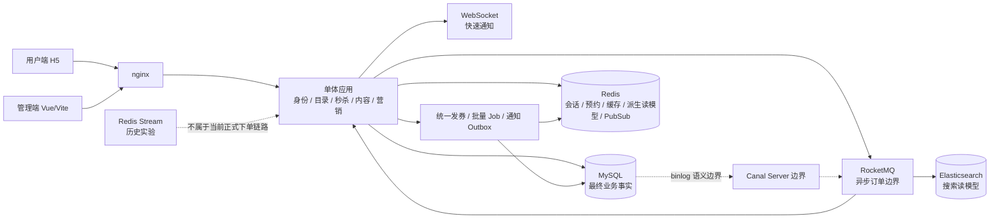
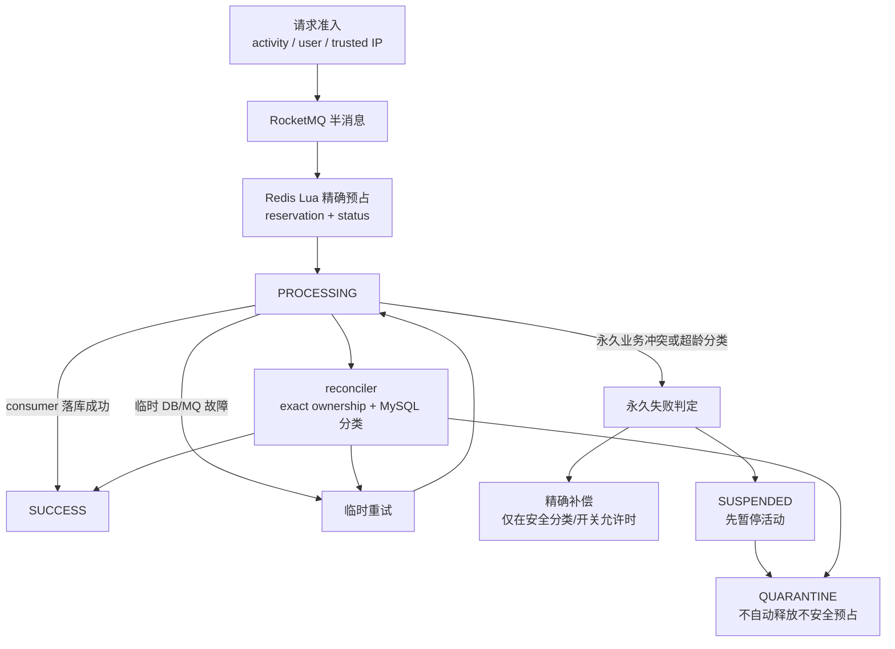

# M7 故障证据索引与架构图

> 状态：M7 证据整理完成；本文件只索引已有结果和无共享依赖的最终契约检查，不重新执行完整 M5D/M6C 故障矩阵。

## 1. 证据级别

| 级别 | 含义 | 可以证明 | 不能证明 |
| --- | --- | --- | --- |
| `isolated-real-it` | 专用 run-id、专用依赖、fail-closed guard 和不变量校验通过的真实集成结果 | 该故障模型下的请求行为、持久状态和本地收敛路径 | 生产 SLA、未覆盖的故障模型或共享环境行为 |
| `consumer-level` | 真实 RocketMQ consumer 处理，但没有完整上游 Canal Server 链路 | consumer 的失败、重试/DLQ 和 ES 重放语义 | Canal Server → RocketMQ → ES E2E |
| `real-http-plus-contract` | 专用 HTTP 运行结果与 JVM 契约测试组合 | 入口行为及本地资源门禁边界 | 多实例全局流控或生产容量 |
| `unit-and-isolated-it` | 单元测试、状态机/对账契约和已有隔离 IT 的组合 | 稳定分类、锁顺序、quarantine 和幂等语义 | M7 新的外部故障注入 |
| `contract-level/manual-demo-ready` | 源码契约检查和人工演示步骤 | 前端有限轮询、持久查询兜底的实现约束 | 没有真实浏览器 E2E 时的浏览器网络行为 |
| `not-tested` | 明确没有运行该场景 | 需求、停止线和后续升级条件 | 任何恢复时间、RPO 或 PASS 结论 |
| `historical-baseline` | 旧 Redis Stream 对照实验 | 历史链路当时的正确性/故障结果 | 当前 RocketMQ 链路的性能提升比例 |

机器可读镜像见 [`m7-failure-matrix.csv`](m7-failure-matrix.csv)。

## 2. 已复用的正式结果

| 阶段/场景 | 状态 | run-id | 对应提交 | 结果入口 | 依赖范围 |
| --- | --- | --- | --- | --- | --- |
| M5C 资源门禁与单实例过载 | PASS；Broker 早期 BLOCKED 保留为历史事实 | `m5c-20260821e` | `2f83b6b`（结果收口） | [`m5c-resource-traffic-results.md`](../m5/m5c-resource-traffic-results.md) | 专用 MySQL/Redis/ES/RocketMQ；入口 semaphore/singleflight 为 JVM 本地 |
| M5D F1 Redis 短时不可用 | PASS | `m5d-20260822a` | `2f83b6b` | [`m5d-reliability-results.md`](../m5/m5d-reliability-results.md) §3 | 专用 MySQL/Redis/ES/RocketMQ；Redis pause |
| M5D F2 MySQL 不可用 | PASS | `m5d-20260822a` | `2f83b6b` | [`m5d-reliability-results.md`](../m5/m5d-reliability-results.md) §3 | 专用 MySQL；保留 Hikari/driver 约 30 秒 leader 边界 |
| M5D F3 consumer pause/消息延迟 | PASS | `m5d-20260822a` | `2f83b6b` | [`m5d-reliability-results.md`](../m5/m5d-reliability-results.md) §3 | 专用 RocketMQ consumer group；接受后暂停，恢复后 backlog 收敛 |
| M5D F4 ES 不可用 | PASS，consumer-level | `m5d-20260822a` | `2f83b6b` | [`m5d-reliability-results.md`](../m5/m5d-reliability-results.md) §3 | 专用 RocketMQ ES consumer + ES；不是 Canal E2E |
| M5D F5 Broker 不可用 | PASS | `m5d-20260822a` | `2f83b6b` | [`m5d-reliability-results.md`](../m5/m5d-reliability-results.md) §3 | 严格 PID/TCP/label/topic/group 门禁后运行 20 个新请求 |
| M3/M5 `PROCESSING` 永久冲突与 quarantine | PASS，组合证据 | N/A（单元/既有隔离 IT） | `dd36b4b` | [一致性设计](../../design/seckill-consistency-and-recovery.md)、[`SeckillOrderReconcilerTest`](../../../src/test/java/com/localdeals/service/SeckillOrderReconcilerTest.java)、[`SeckillOrderStateIT`](../../../src/test/java/com/localdeals/service/SeckillOrderStateIT.java) | Redis 状态机、MySQL exact 分类和共享用户锁；没有为 M7 重跑外部故障 |
| M6A/M6B/M6C 业务底座 | COMPLETED | `m6a_close_20260822b` / `m6b_20260822e` / `m6c_20260823h` | `cea3d5d` / `3800656` / `054b113` | [M6A](../m6/m6a-targeted-grant-results.md)、[M6B](../m6/m6b-daily-task-results.md)、[M6C](../m6/m6c-batch-notification-results.md) | M6C 只启用专用 MySQL+Redis；没有 RocketMQ/ES 通知链路 |

## 3. 故障矩阵结论

| 场景 | 状态/级别 | 关键结论 | 限制 |
| --- | --- | --- | --- |
| Redis 短时不可用（M5D F1） | PASS / `isolated-real-it` | 鉴权和秒杀 503 `AUTH_STATE_UNAVAILABLE`；安全商铺读回 DB；订单和库存无增量；恢复 79ms | 这是短时 pause，不是全量数据丢失；79ms 是本地观察值，不是生产 SLA |
| Redis 全量数据丢失 | NOT TESTED / `not-tested` | 必须先停止新预占，恢复 AOF/备份后按 reservation/status/库存/订单精确对账 | 没有 RPO、恢复时间或可自动重建结论；需要备份/AOF 演练后才能升级 |
| MySQL 不可用（M5D F2） | PASS / `isolated-real-it` | 新读写按稳定 503/受控降级处理；恢复后 readiness 和业务探针通过；业务行不变 | 一个 leader 保留既有约 30 秒 Hikari/driver 边界；不能包装成所有请求小于 2 秒 |
| consumer pause/消息延迟（M5D F3） | PASS / `isolated-real-it` | 已接受请求保持 `PROCESSING`，恢复后主/retry/DLQ 收敛为 0/0/0，订单和 reservation 为 `SUCCESS` | 只覆盖该专用 consumer group 和演示规模 |
| ES 不可用（M5D F4） | PASS / `consumer-level` | 入口 429/503；目标消息失败计数增加，恢复重放后固定文档 ID 只有一份 | 不是 Canal Server → RocketMQ → ES E2E；event lag 未测为 `NA` |
| Broker 不可用（M5D F5） | PASS / `isolated-real-it` | 20/20 新请求 503 `SECKILL_SUBMIT_UNAVAILABLE`，库存、reservation、PROCESSING、DB 无增量 | 只证明新请求 fail closed；不等于已在 Broker 的任意消息都已恢复 |
| 单实例过载（M5C） | PASS / `real-http-plus-contract` | activity/user/IP 固定窗和 DB_READ/SEARCH 本地门禁拒绝过载；已接受订单不受入口 guard 误伤 | semaphore/singleflight 是 JVM 本地；固定窗可能有相邻窗口突发；不支持 Redis Cluster 全局流控 |
| DB 永久冲突/quarantine | PASS / `unit-and-isolated-it` | `ORDER_ID_CONFLICT` 先暂停并 quarantine，不能自动释放；DB 异常不等于无单；迟到消息受 exact 状态门禁 | 没有 M7 新的外部冲突注入；RPO 仍受 Redis 持久性和锁语义边界约束 |
| Redis Pub/Sub/通知 Outbox（M6C） | PASS / `isolated-real-it` | grant、`granted_count`、Outbox 同事务；Redis 停止时 PENDING，恢复后 25ms 发布并收敛 | `PUBLISHED` 只表示 Redis 接受；不表示在线、已读或实际收到；不是 RocketMQ 通知 |
| WebSocket 断线 | BOUNDARY / `contract-level/manual-demo-ready` | `onclose/onerror` 进入有限 `/voucher-grants/mine` 轮询，最多 10 次且有总 deadline；成功/失败终态停止 | 没有真实浏览器 E2E；持久查询是最终事实，实时通知只是加速路径 |
| Canal 完整 E2E | NOT TESTED / `not-tested` | 保留 M5D consumer-level ES 证据作为边界 | 没有 Canal Server → RocketMQ → ES 完整链路结论 |
| M6 RocketMQ 通知 | NOT APPLICABLE / `not-applicable` | M6 通知明确使用 Redis Pub/Sub + WebSocket | 不增加 topic/consumer，也不声称验证 MQ 通知 |
| Redis Stream baseline/current | HISTORICAL_ONLY / `historical-baseline` | 仅保留 2026-05 历史正确性与 pending/DLQ 对照 | 不能与当前 RocketMQ 版本直接计算性能提升百分比 |

## 4. 系统边界图

图中 `Canal Server` 到 RocketMQ 的虚线只表示系统边界，不表示本阶段已有完整 E2E 证据；
`Redis Stream` 只保留历史对照。当前没有画 Redis Cluster、双轨发布或“绝对不丢消息”。

## 5. 秒杀状态流转图

状态图只表达当前代码已有的半消息、Lua、`PROCESSING`、重试、精确补偿、暂停、quarantine
和 reconciler 语义；它不承诺消息绝不丢失，也不画出尚未实现的新旧协议双轨混跑。

## 6. 诚实边界

- Redis 全量数据丢失恢复和确定 RPO 未验证。
- 完整 Canal Server → RocketMQ → ES E2E 未验证；M5D F4 是 consumer-level。
- M6 通知没有使用 RocketMQ。
- M5D/M6C 的恢复时间是专用本地环境观测，不是生产 SLA。
- 当前不支持 Redis Cluster；秒杀多 key Lua 仍依赖单机或 Sentinel 共享主节点。
- 不支持新旧秒杀消息协议滚动混跑；需停写、排空和回填门禁。
- 没有核销、支付、退款，也没有 Spring Boot 3/Java 17 升级。
- 历史 baseline/current 与当前 RocketMQ 版本不可直接计算性能提升百分比。
