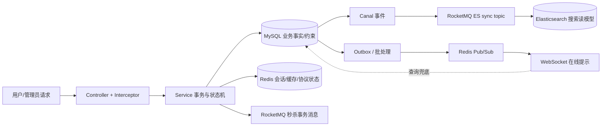

# 01. 系统地图：从请求到事实、异步和提示

## 结论先行

这是一个 Java 8、Spring Boot 2.3.12 的模块化单体。它把“写入正确性”和“读取/通知性能”拆开：MySQL 负责可审计事实，Redis 负责短期协议和加速，RocketMQ 负责秒杀交付，Elasticsearch 负责搜索读模型，WebSocket 负责在线提示。

这张图有两个容易误读的地方：一是 Canal 事件链并非所有证据都覆盖；二是 WebSocket、热榜和搜索都是读侧或提示侧能力，不能替代 MySQL 事实。

## 业务主链路

| 主链路 | 入口 | 关键事实 | 异步/加速层 | 主要回退 |
| --- | --- | --- | --- | --- |
| 后台与商户范围 | `/admin/**`、`/ws/admin/connect` | `tb_admin_account`、角色/权限、`tb_shop.merchant_id` | Redis session/ticket、WebSocket channel | 重新加载 MySQL account/role/scope |
| 秒杀 | `POST /voucher-order/seckill/{id}` | `tb_voucher_order`、V2 唯一键、MySQL stock | Redis Lua admission/state + RocketMQ transaction | status 查询、PROCESSING reconciler、quarantine |
| 点赞与热榜 | `PUT/DELETE /blog/{id}/like` | `tb_blog_like`、`tb_blog_like_outbox`、`tb_blog.liked` | Redis 热榜、generation fence | MySQL `liked DESC,id DESC` |
| 营销发券 | `/voucher-campaigns/**`、`/admin/marketing/**` | campaign、grant、sign、batch item、notification outbox | Redis Pub/Sub、WebSocket、有限批量 worker | `/voucher-grants/mine` 持久查询 |
| 搜索/普通缓存 | `/shop/search`、`/shop/{id}` | MySQL shop/shop_type | Redis cache/GEO、ES index | MySQL 详情或明确 503；搜索不会无界 LIKE 回退 |

## 数据库演进如何对应业务边界

- V1 提供 tutorial 基线：用户、店铺、券、秒杀券、订单、博客、签到等基础表。
- V2 给 `tb_voucher_order(user_id,voucher_id)` 增加唯一键，把“一人一单”变成数据库约束，而不依赖应用先查后写。
- V5–V6 增加 merchant、admin account、RBAC、`merchant_id` 回填和 `auth_version`。
- V7–V8 把点赞从单一计数扩展为用户关系、事务 Outbox 和 cutover marker。
- V9–V10 增加标签、活动、统一 grant、签到和任务奖励的幂等键。
- V11 增加批量 Job/item 和发券通知 Outbox；它们是可恢复的 MySQL 工作队列，不是一次性内存任务。

具体列、唯一键、外键和状态枚举以 [V1–V11 migration](../../src/main/resources/db/migration/) 及各链路文档为准。

## 横切保障

`LocalReadBulkhead` 将 DB read 与 search 分成两个 JVM 内 semaphore，`SingleFlightLoader` 合并同一 JVM 同一 key 的回源；它们不是分布式限流。`SeckillTrafficGuard` 使用 Redis server time 的固定窗口，在生成订单号和投递 MQ 之前拒绝超限请求。`CacheClient` 对 Redis 读错误、空值、坏 JSON 有不同指标，并尽量回源 MySQL；缓存写失败不覆盖数据库结果。

`LocalDealsMetrics` 预注册有限枚举标签，记录 outbox、hot rank、MQ consume、grant、cache、ES、traffic 和 backlog。采集失败时 Gauge 置为 `NaN`，避免把“不可观测”伪装成零。

### 横切代码导航与判断

| 横切能力 | 代码入口 | 保护什么 | 失败时的正确理解 |
| --- | --- | --- | --- |
| 普通缓存 | [`CacheClient`](../../src/main/java/com/localdeals/utils/CacheClient.java)、[`SingleFlightLoader`](../../src/main/java/com/localdeals/utils/SingleFlightLoader.java)、[`ShopServiceImpl`](../../src/main/java/com/localdeals/service/impl/ShopServiceImpl.java)、[`ShopTypeServiceImpl`](../../src/main/java/com/localdeals/service/impl/ShopTypeServiceImpl.java) | 空值、坏值、Redis 读错、同 JVM 回源合并 | 缓存写失败不覆盖 DB；singleflight/semaphore 都是 JVM 本地 |
| 搜索读模型 | [`ShopServiceImpl.searchShops`](../../src/main/java/com/localdeals/service/impl/ShopServiceImpl.java)、[`EsSyncConsumer`](../../src/main/java/com/localdeals/mq/EsSyncConsumer.java)、[`ElasticsearchConfig`](../../src/main/java/com/localdeals/config/ElasticsearchConfig.java) | ES 查询超时、固定连接/socket timeout、MySQL 回查完整字段 | ES 不是 shop/blog 事实；当前 consumer-level 测试不覆盖 Canal E2E |
| 入口/资源流控 | [`SeckillTrafficGuard`](../../src/main/java/com/localdeals/service/SeckillTrafficGuard.java)、[`LocalReadBulkhead`](../../src/main/java/com/localdeals/service/LocalReadBulkhead.java) | 秒杀 activity/user/IP admission、DB read/search 的本地 permit | 429/503 是有界保护语义，不是容量证明或全局集群限流 |
| 可观测 | [`LocalDealsMetrics`](../../src/main/java/com/localdeals/observability/LocalDealsMetrics.java)、[`ReliabilityBacklogCollector`](../../src/main/java/com/localdeals/observability/ReliabilityBacklogCollector.java)、[`VoucherGrantNotificationBacklogCollector`](../../src/main/java/com/localdeals/observability/VoucherGrantNotificationBacklogCollector.java) | 有限标签、outbox/processing/hot-rank/grant backlog | metric/health 只能描述水位；不能替代业务不变量、恢复检查或消息 backlog 真相 |

对应的仓库记录包括 `CacheClientTest`/`SingleFlightLoaderTest` 的回源与 follower timeout 契约、M5C 的本地 semaphore/traffic 场景、`EsSyncConsumerMetricsTest`/`CanalSyncIT` 的 consumer-level 行为，以及 M5A/M7/Pre-M8 的限定环境结果。读取这些数字时，必须同时看依赖拓扑、是否真实连接、最终业务状态和失败明细。

## 启动和 rollout 不是默认开启

当前 `application.yaml` 默认关闭点赞写/worker、热榜读/refresh、秒杀 reconciler/backfill、批量 Job worker 和通知 worker；这些能力有 marker、配置开关或显式启动门禁。默认配置和当前 stage 不能被简化为“全部生产启用”。

## 不能从系统地图推出的结论

- 当前代码没有实现 Redis Cluster/Sentinel 的生产 HA 证明，也没有 RPO 结论。
- 搜索 consumer 的直接 `onMessage` 测试不是 Canal Server 到 RocketMQ 再到 ES 的完整 E2E。
- 本地恢复时间、JMeter throughput/P99 和 drain 时间不等于生产 SLA 或容量上限。
- 支付、退款、核销、完整离线通知、动态营销规则和 Java 17/Spring Boot 3 不在当前实现闭环内。
